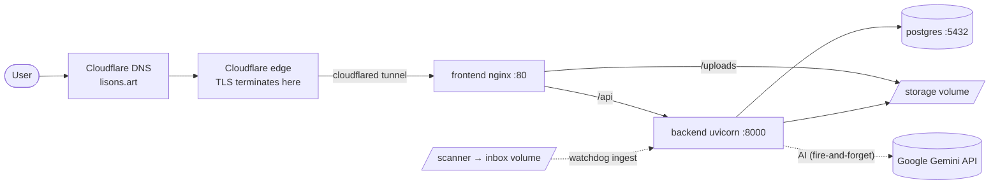

# Architecture — Lisons!

> **Last verified:** 2026-06-19
> The **Global infrastructure** section is homelab-wide and identical across every project on this box. The **Project** section is specific to this repo.

---

## 1. Global infrastructure (homelab-wide)

### Homelab host

| Property | Value |
|---|---|
| Box / OS | TrueNAS (SCALE) |
| LAN IP (static/reserved) | `192.168.1.70` |
| SSH user | `truenas_admin` |
| App data root | `/mnt/ssd_pool/apps_data/<app>/` |
| Storage pool(s) | `ssd_pool` |

### Local network

| Property | Value |
|---|---|
| Subnet / CIDR | `192.168.1.0/24` (inferred from host `.70`) |
| Gateway / router | `192.168.1.1` — _TODO: confirm_ |
| Router / firewall | UniFi / Ubiquiti (managed) |
| VLAN (if any) | _TODO: confirm (single LAN assumed)_ |
| Remote access | None — LAN + SSH only (no VPN); remote use is via the public site through Cloudflare |

> UniFi is the router/firewall, so subnet, gateway, VLANs and any port-forwards can be confirmed live via the UniFi Network MCP (`unifi-network` skills) instead of by hand.

### Edge & DNS

| Property | Value |
|---|---|
| DNS provider | Cloudflare |
| CDN / proxy | Cloudflare (orange-cloud proxy) |
| Ingress path | **Cloudflare Tunnel (`cloudflared`)** — outbound tunnel from the host to Cloudflare; **no inbound ports forwarded on the router** |
| TLS termination | Cloudflare edge (origin reached over the encrypted tunnel) |
| Cache rules | Cache Rule "Bypass cache for `/uploads/`" (URI path starts with `/uploads/` → Bypass). Added after a 404-poisoning incident. **Now removable** — since commit `e1e8555` the app appends `?v=<updated_at>` to image URLs and nginx serves `/uploads` as `immutable`, so stale/404 poisoning can't recur. |

### Platform services

| Service | Detail |
|---|---|
| Container registry | `ghcr.io/dundee31416/<repo>` |
| CI/CD | Woodpecker — deploys on **push to `main` only**, after `ruff`+`pytest` (backend) and `eslint`+`tsc` (frontend) pass. Plugins: `appleboy/drone-ssh` + `appleboy/drone-scp`. |
| Orchestration | Docker Compose on the host (`docker compose up -d`) |
| Secrets store | Host-only `.env` at `/mnt/ssd_pool/apps_data/<app>/.env` (never in the repo); deploy SSH key at `C:\Users\dunde\.ssh\woodpecker_deploy` (laptop) |
| Image tags / rollback | Every image tagged `latest` **and** `${CI_COMMIT_SHA:0:8}` — roll back by pinning the previous SHA tag in the host's `docker-compose.prod.yml` |

### Backups & recovery

| What | How | Retention |
|---|---|---|
| Filesystem (`apps_data`) | TrueNAS recursive daily ZFS snapshot task on `ssd_pool` (midnight, naming `auto-%Y-%m-%d_%H-%M`) | 2 months |
| Databases | `db-backup` compose sidecar: nightly `pg_dump -Fc` into `./backups`, pruned after `BACKUP_KEEP_DAYS` | 14 days (default) |

Recovery notes: restore the DB from the latest `pg_dump` (`pg_restore`); restore `storage/` (author images) from a ZFS snapshot. **Do not** create a second ZFS snapshot task — one recursive task already covers `ssd_pool/apps_data`.

---

## 2. Project — Lisons!

**What it is:** A website where children ("authors") publish their handwritten/drawn storybooks. A scanner drops images into a filesystem inbox; the backend ingests them, optionally runs Google Gemini AI (cleanup, re-illustration, French transcription), and serves them to a public reader.

**Repo / images:**
- `ghcr.io/dundee31416/site_sophie-backend:latest` (+ SHA tag)
- `ghcr.io/dundee31416/site_sophie-frontend:latest` (+ SHA tag)
- Host deploy dir: `/mnt/ssd_pool/apps_data/site_sophie/`

### Public access

| Property | Value |
|---|---|
| Public URL | `https://lisons.art` |
| Public reader path | `https://lisons.art/lecture/:author/:slug` |
| DNS record | `lisons.art` at Cloudflare (proxied: **yes**, orange-cloud) |
| Public entry | Cloudflare Tunnel → host `:${WEB_PORT:-80}` (no public port-forward) |

### Services & ports

| Service | Image | Container | Host port → container | Exposure |
|---|---|---|---|---|
| frontend | `…/site_sophie-frontend` | `site_sophie_frontend` | `${WEB_PORT:-80}` → `:80` (nginx) | Public via Cloudflare Tunnel |
| backend | `…/site_sophie-backend` | `site_sophie_backend` | `:8000` (uvicorn, health `/api/health`) | Internal only |
| postgres | `postgres:16-alpine` | `site_sophie_pg` | `:5432` | Internal only |
| db-backup | `postgres:16-alpine` | `site_sophie_db_backup` | — | Internal only (sidecar) |

nginx serves the SPA and proxies `/api` → backend; `/uploads` is served from the storage volume with an immutable cache header.

### Request flow

### Data & volumes

All under `/mnt/ssd_pool/apps_data/site_sophie/` (bind mounts):

| Path / volume | Holds | Backed up |
|---|---|---|
| `./pg_data` → `/var/lib/postgresql/data` | Postgres data | ZFS snapshot + pg_dump |
| `./storage` → `/data/storage` | Author works/images (`STORAGE_ROOT`, served at `/uploads`) | ZFS snapshot |
| `./inbox` → `/data/inbox` | Scanner drop zone (`INBOX_ROOT`), watched for ingestion | ZFS snapshot |
| `./backups` → `/backups` | Nightly `pg_dump` files | ZFS snapshot |

### Configuration & secrets

Prod values live in **`/mnt/ssd_pool/apps_data/site_sophie/.env`** on the host (not in the repo). Required keys:

| Key | Purpose |
|---|---|
| `POSTGRES_USER` / `POSTGRES_PASSWORD` / `POSTGRES_DB` | Database credentials |
| `WEB_PORT` | Host port nginx publishes (default `80`) |
| `PUBLIC_BASE_URL` | Public origin (`https://lisons.art`) for absolute URLs |
| `JWT_SECRET` / `JWT_EXPIRE_DAYS` | Auth token signing |
| `ADMIN_USERNAME` / `ADMIN_PASSWORD` | Seeded admin account |
| `COOKIE_SECURE` / `COOKIE_SAMESITE` / `COOKIE_NAME` | Session cookie (`COOKIE_SECURE=true` is the prod marker) |
| `CORS_ORIGINS` | Allowed browser origins |
| `BACKUP_KEEP_DAYS` | pg_dump retention |
| `GEMINI_API_KEY` | Google Gemini (AI features 503 without it) |

> Secret *values* are never recorded here — only their names and where the real values live. `settings.py` refuses to boot with weak/default `JWT_SECRET` or `ADMIN_PASSWORD` while `COOKIE_SECURE=true`.

### Operational notes

- **Ingestion is filesystem-driven, not upload-driven** — the scanner writes into the `inbox` volume; a watchdog observer in the FastAPI lifespan ingests on file-stable.
- **AI is fire-and-forget** — background tasks die with the process; `main.py` clears orphaned `*_pending` flags on startup.
- **Debugging missing prod images:** `curl -sI 'https://lisons.art/uploads/<path>' | grep -iE 'cf-cache|age|cache-control'` — a `cf-cache-status: HIT` on a 404 means cache poisoning; purge via the Cloudflare dashboard.
- **Local backend tests** need a `uv venv --python 3.12` (host Python 3.14 is too new for pinned deps).
- TODO: confirm LAN gateway IP and whether a dedicated VLAN exists (pull from UniFi MCP).
